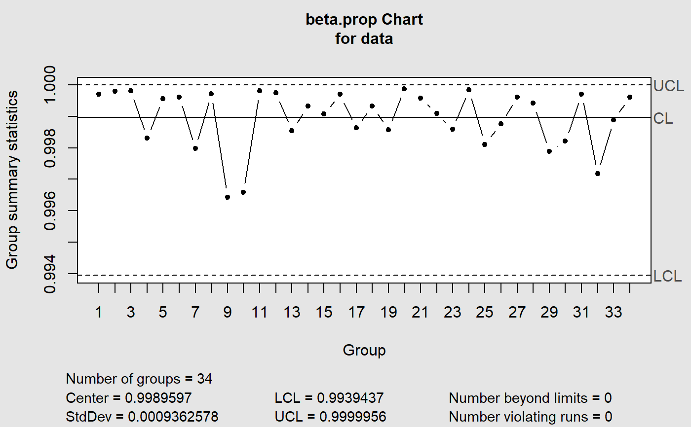

# Beta Control Charts (bcc)


An [R](https://www.r-project.org/) package for **quality control charting using beta control charts**.

<center>

</center>
<br>

## Installation

You can install the the development version from GitHub:

``` r
# install.packages("devtools")
devtools::install_github("danielucas28/bcc", build = TRUE, build_opts = c("--no-resave-data", "--no-manual"))
```

## Usage


``` r
bcc(data, type = c("1", "2"), sizes, center, std.dev, limits, data.name,
  labels, newdata, newsizes, newdata.name, newlabels, nsigmas = 3,
  confidence.level = 0.9, rules = shewhart.rules, plot = TRUE, ...)
```

You can see examples in:

``` r
help("bcc")
```
## References

SANT'ANNA, Ângelo M. O; CATEN, Carla Schwengberten (2012). *Beta control charts forsave monitoring fraction data.* Expert Systems With Applications, p. 10236-10243.

Montgomery, D.C. (2009) *Introduction to Statistical Quality Control*, 6th ed. New York: John Wiley & Sons.

Scrucca, L. (2004) [qcc: an R package for quality control charting and
statistical process control](http://www.stat.unipg.it/luca/misc/Rnews_2004-1-pag11-17.pdf). *R News* 4/1, 11-17. 

